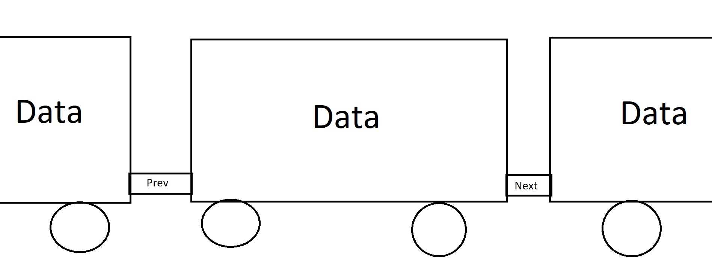
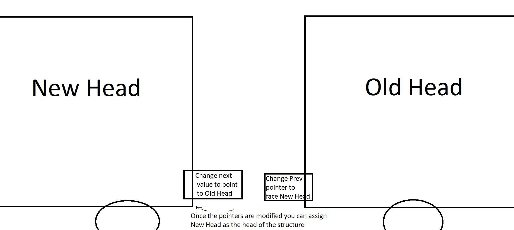
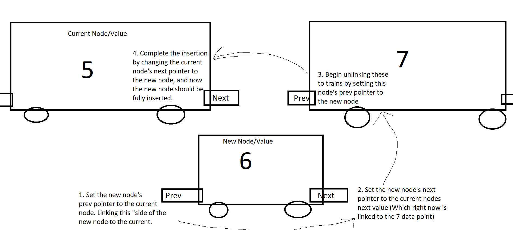

# Linked Lists
## Table of Contents
- [Introduction](#introduction)
- [Train Analogy](#linked-lists-are-like-a-train)
- [Why use a Linked List](#why-use-a-linked-list-in-python)
- [Add and Remove Items in Linked Lists](#how-to-add-and-remove-items-in-linked-lists)
- [Using Linked Lists](#using-linked-lists)
- [Common Operations](#common-operations)
- [Python Example](#python-example)
- [Stacks and Trees](#continue-learning)

[**Welcome Page**](0-welcome.md)
## </a>Introduction 
___
The next data structure we will discuss in this guide is the linked list. A linked list is similar to array, however instead of accessing values via an index, each value is given a pointer to the next. In some cases each value is given two pointers, one to the next value and one to the previous value. In this guide I will discuss a linked list with both previous and next pointers.

## Linked Lists are Like a Train
___
One way you can think of linked lists are kind of like a train. Each boxcar is a data point. From each car you can access the adjacent containers, but you cannot skip over any.

As you can see each train car contains data, to access the adjacent data we can use the prev and next pointers, which act as bridges across the data structure.

While it may seem inconvenient that values cannot be accessed by index, there are benefits in cases when you need to iterate through every value in the data structure.

## Why use a linked list in Python?
___
Linked lists are extremely helpful for iterators. For example, when you need to print every value in the structure, or sum the total. One of the great benefits is that no matter what value you are accessing you can always be pointed to the next or previous data points, allowing the user/programmer to ignore the need for knowing the index.

There are also benefits in the methods used to add and remove values from a linked list. Instead of inserting values like a normal array, all we need to do is change the pointers.

## How to add and remove items in linked lists?
___
As briefly mentioned above, the key to adding and removing values from a linked list are the adjustments made to the data's pointers. One key thing to remember for this section is that linked lists track their current head and tail values, which are used when appending to the beginning or end of the data structure.

**Inserting and removing at the head**

To insert data at the head (or the very start) of a linked list all that needs to happen is to change the current head's previous pointer to the new value, the new values next pointer to the current head and assign that new value as the head so it can be called from the start. This is like placing a new boxcar at the head of the train in our analogy.

Removing values from the head is a similar process, but this time you change the head value to the current head's next value and change the prev pointer so it is no longer pointing to the removed value.

**Inserting and removing at the tail**

To add and remove values from the tail we use a similar process as with the head. To add to the tail, we set the current tail's next pointer to the new value and the new value's previous pointer to the current tail. We then change the current tail value to be the new value via the next pointer. You can think of this as the same as the head, but reverse the next and prev pointers.

**Inserting and removing at the middle**
While adding and removing from the middle is more complicated than at the head, the basic premise of adjusting pointers remains the same.

By first setting the new node's next and previous pointers to a current node and the current node's next we are in a way connecting the boxcar to be in between the two other nodes. We finalize its position by changed the other node's prev and next pointers to point to the new node, resulting in an unbroken chain that does not skip any values.

Removing nodes from a linked list is a simpler process as all that needs to change are to change the pointers of the nodes around the current node(node to be removed) to point to each other. In other words, current.prev.next (the next pointer of the node before the current node) is set to point to current.next (the node after the current node) and current.next.prev (the prev pointer of the node after current node) is set to current.prev. In this way we would be relinking the 5 and 7 values from the picture above, and no more work is needed as those two will always skip node 6. Note that to save on memory you may need to make some adjustments to remove the data of the node after it has been removed.

## Using Linked Lists
___
Linked lists are especially useful in recursive cases. For example, searching for data, one could call a function with a desired value to find and the function could compare the current node (starting at the head) to the data and if it doesn't find it call itself with the next pointer until either the value is found, or the list has no more values

## Common Operations 
___
Operation   | Python Usage        | How does it work? | Efficiency
------------|---------------------|-------------------|-----------
insert_head(value)|my_deque.appendleft(value)| Adds value before the current head | O(1)
insert_tail(value)|my_deque.append(value)    | Adds value after current tail | O(1)
insert(i, value)  |my_deque.insert(i, value) | Adds value after the i node   | O(n)
remove_head()     |value = my_deque.popleft()| Removes current head value    | O(1)
remove_tail(index)|value = my_deque.pop()    | Removes the current tail value| O(1)
remove(i)         |del my_deque[i]           | Removes the i node            | O(n)
size()            |length = len(my_deque)    | Returns the size of the linked list| O(1)
empty()           |if len(my_deque) == 0:    | Returns true if the list is empty| O(1)

Most of the efficiency values for operations on linked lists are O(1), this is true for cases of changing the head and tail of the linked list. This is because we already know where the head and tail values are and changing the values of pointers is a constant efficiency level as no other values in the list need to be changed. The insert and remove operations that change data in the middle of the list are O(n) not because of the changing of pointers, but because the desired point in the list needs to be found, which is O(n)

Linked lists are way more efficient than arrays in cases where head values are changed frequently, or values a the beginning of the list are changed. This is because to insert or remove values in an array the whole array needs to be displaced, while in a linked list once the value is found, only pointers need to be changed. 

## Python Example
___
Here is a demo of a Linked List class written in python, here you can see the workings of a linked list as well as my implementation of the count method, which returns the number of times a value appears in a linked list. 
- ### [**Linked List Demo**](linklist-demo.py)
## Problem Case
Now get some practice with Linked Lists yourself. Using the given Linked List problem script:
1. Write the size operation for the linked list class. This should return the number of nodes in the linked list. For example if there are 5 nodes in the list it should return 5.
2. Write the empty operation for the linked list class. This should return True of there are no nodes in the linked list and False if there are nodes in the linked list.

- ### [**Linked List Problem**](linklist-problems.py)
- ### [**Linked List Solution**](linklist-solution.py)

Congratulations on learning more about Linked Lists!

# Continue Learning
- ### [Stacks](1-topic.md)
- ### [Trees](3-topic.md) (not complete)

[**Welcome Page**](0-welcome.md)